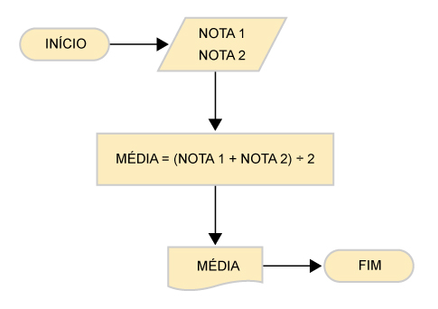

## 🧪 FIXAÇÃO – FAÇAMOS JUNTOS!

## 🧪 PRATIQUE 01

Faça um algoritmo para a tarefa "Preparar miojo" e represente a sua solução utilizando os conceitos de "Fluxograma" e "Descrição narrativa".

  

## 🧪 PRATIQUE 02

Faça um algoritmo para a tarefa "Calcular média" utilizando a forma de representação "Português Estruturado". Para isso, utilize como base o funcionamento descrito no fluxograma ao lado.

## 🧪 FIXAÇÃO – FAÇA VOCÊ MESMO!

## 🧪 PRATIQUE 01

Faça um algoritmo utilizando o "Pseudocódigo" para ler dois valores (x e y), calcular e mostrar x elevado a potência de y.

  

## 🧪 PRATIQUE 02

Faça um algoritmo utilizando o "Pseudocódigo" que leia dois números reais e em seguida mostre: a soma, o produto, a divisão e a subtração entre eles.

